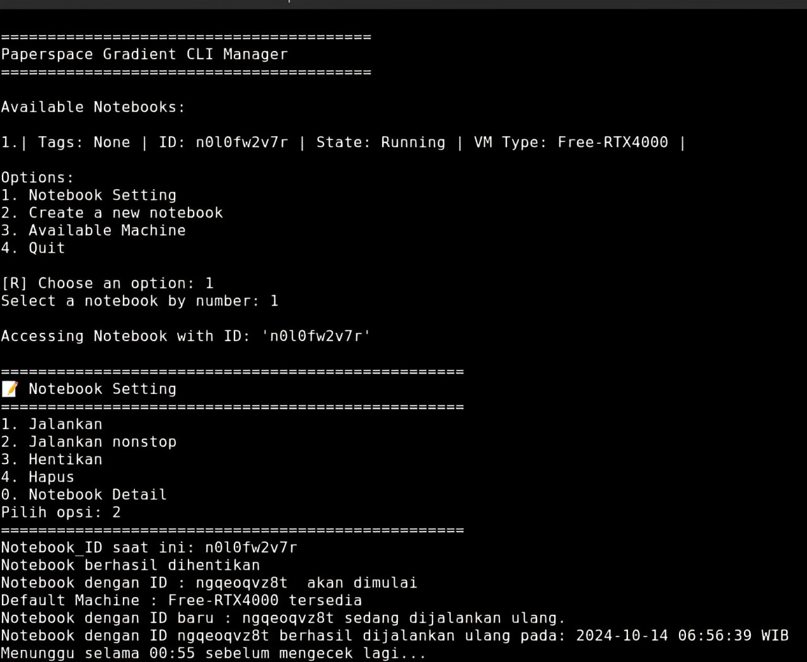

# Paperspace CLI Manager


[English](readme.md) | [Bahasa Indonesia](readme_ID.md)

**Paperspace CLI Manager** is the ideal solution for users frustrated with the slow and often buggy Paperspace Gradient UI. This CLI-based manager allows you to manage your Paperspace Gradient notebooks quickly and efficiently through the terminal, eliminating the need to rely on the web UI.

With this repository, you can handle various notebook configurations and management directly from the command line, removing the need to wait for the often sluggish web interface.

## Features

Here are the main features of **Paperspace CLI Manager**:

1. **Create new notebooks**: Create notebooks directly from the terminal without using the web UI.
2. **Start, stop, and delete notebooks**: Fully control your notebooks from the command line.
3. **Check machine availability**: Quickly and in real-time check GPU or other machine availability.
4. **View notebook details**: Get detailed information about the notebooks you're managing.

## Key Features

Beyond the basic functionalities, this repository also includes advanced features not available in the Paperspace Gradient web interface:

1. **Bypass the 6-hour notebook session limit**: Automatically monitor and restart notebooks if they stop due to reaching the 6-hour time limit.
2. **Automatically check GPU availability**: If the desired GPU is unavailable, this script will check every 30 seconds until one becomes available, eliminating the need for manual checks.

This repository will continue to be developed with additional features in the future!

## Installation

### Using a Virtual Environment

To avoid dependency conflicts, it is highly recommended to use a **virtual environment (venv)** in Python. Make sure you're using **Python version 3.7** before proceeding.

1. **Ensure Python 3.7 is installed**:
   If not, download and install Python 3.7 from [python.org](https://www.python.org/downloads/release/python-370/).

2. **Create a virtual environment**:
   Create a virtual environment with Python 3.7 to prevent dependency conflicts:
   ```bash
   python3.7 -m venv venv
   ```

3. **Activate the virtual environment**:
   - On macOS/Linux:
     ```bash
     source venv/bin/activate
     ```
   - On Windows:
     ```bash
     .\venv\Scripts\activate
     ```

4. **Install required packages**:
   After activating the virtual environment, install the necessary packages with:
   ```bash
   pip install -r requirements.txt
   ```

5. **Set up Paperspace Token & Project_ID**:
   After all packages are installed, run `Enter Paperspace Token & Project_ID` with the command:
   ```bash
   python main.py
   ```

6. **Run Paperspace CLI Manager**:
   Run `Paperspace Gradient CLI Manager` with:
   ```bash
   python main.py
   ```

### Using Docker

For a simpler setup, you can also run **Paperspace CLI Manager** using Docker. Here are the steps:

1. **Ensure Docker is installed on your computer**.
2. **Run setup.py**:
   ```bash
   python3 setup.py
   ```
3. **Build the Docker image**:
   ```bash
   docker build -t paperspace-cli-manager .
   ```
   Wait for the build process to complete.
4. **Run with Docker**:
   ```bash
   docker run -it --rm paperspace-cli-manager
   ```

After completing the steps above, you're ready to use **Paperspace Gradient CLI Manager** in your configured environment.

## Contributors

This repository was created with dedication by myself and my BestFriend, **ChatGPT**. We collaborated to provide a fast and efficient solution for Paperspace Gradient users who prefer command-line usage.
